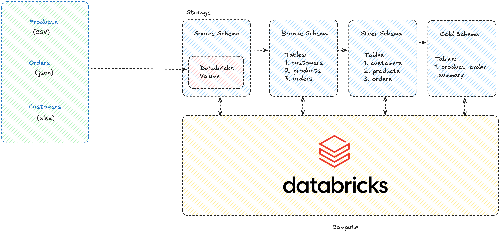

# Ecommerce Sample Pipelines

## Architecture

### Medallion architecture



#### Bronze Layer

All tables - customers, products and orders are first ingested into the raw/bronze layer.

Bronze layer acts as a raw source of truth.

All bronze layer tables are append only data sources (sink). So we can maintain the full history of the data available.

#### Silver Layer

Silver layer has deduplicated and transformed data. Data transformation is done based on the requirements.

- Known issue: name column in the customers dataset

#### Gold Layer

- 1 orders summary table aggregated by year, category, subcategory and customer name

## Project Structure

```
.
├── bronze
│   ├── customers.ipynb
│   ├── orders.ipynb
│   └── products.ipynb
├── gold
│   └── product_summary.ipynb
├── README.md
├── silver
│   ├── customers.ipynb
│   ├── orders.ipynb
│   └── products.ipynb
├── source
│   └── setup.ipynb
├── tests
│   ├── test_runner.ipynb
│   └── test_transformations.py
└── utils
    ├── dwh_utils.py
    ├── transformation_utils.py
    └── unity_catalog_utils.py

```

## Critical Information

- VS code extension does not work well with free edition of databricks so use databricks UI to develop the workflows.

## Project Setup and execution order

1. Run the `setup` notebook located under `source` directory. This notebook will setup all the required catalog and schemas for the project.

2. Run the notebooks located in the `bronze` directory

3. Run `products` and `customers` dimension notebooks from `silver` first as `orders` job uses both of them.

4. `Gold` directory contains SQL and summary table.

## Assumptions

For simplification, `spark.read` is used to read data from the volume. In production, it would be something like `autoloader` or custom logic to ensure only new/updated files are picked for the processing.

## Tests

- Unit tests are located in `tests` directory. Run the `test_runner` notebook to execute the pytest based tests on databricks environment.
- In production, these tests can be developed and executed on vs code with databricks connector locally and integrated with CI/CD pipelines.

## Locally Running Test

## Setup UV env

1. uv sync

## Activate Env

```
source .venv/bin/activate
```

## Check installed dependancies

```
uv tree
```

## JDK

JDK 17 is required to support latest spark version and pyspark code.

## Running tests locally

1. Activate the venv using command `.venv/bin/activate`
2. First to go the `tests` directory
3. Run command `pytest`

## Variations

### Running all tests

```
pytest
```

### Running a specific module

```
pytest <MODULE>py
```

### Running with console output

```
pytest -v -s
```
